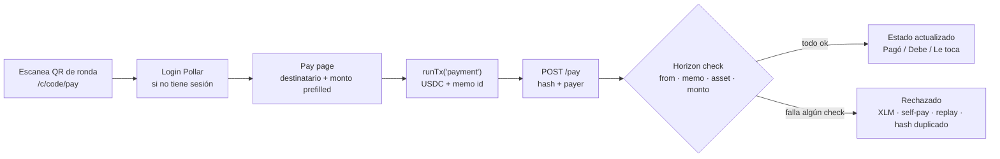

# Pasanaku digital

Círculos de ahorro rotativo sobre Pollar. El organizador crea el círculo (monto, frecuencia, orden de turnos). Los miembros entran con un QR o un link. Cada ronda se paga escaneando el QR de cobro: el USDC llega a la cuenta Pollar de quien le toca. El estado (pagó / debe / le toca) y el historial con hashes quedan a la vista.

Issue: https://github.com/pollar-xyz/pollar-apps/issues/4

## Cómo se llama

En Bolivia es **pasanaku**. El mismo mecanismo existe en toda la región con otro nombre: tanda (México), pandero (Perú), natillera (Colombia), cuchubal (Centroamérica), san (Caribe), rueda (Argentina), polla (Chile), sòl (Haití). La app usa pasanaku porque el issue es boliviano. La tabla completa está en la home.

## Correr desde un clone fresco

```bash
cd apps/pasanaku-circles
cp .env.example .env
pnpm install
pnpm dev
```

La única variable obligatoria es `NEXT_PUBLIC_POLLAR_PUBLISHABLE_KEY` (`pub_testnet_…` en https://dashboard.pollar.xyz → Build → API Keys).

La base es un archivo SQLite `data/pasanaku.db` (libSQL), creado al primer request. En Vercel seteá `TURSO_DATABASE_URL` y `TURSO_AUTH_TOKEN` porque el filesystem serverless no persiste.

## Cómo se usa

1. Entrá con Pollar.
2. **Crear círculo** (`/c/new`): nombre, monto USDC, frecuencia (semanal / quincenal / mensual). El organizador queda como primer miembro. En ese dispositivo puede sortear o reordenar turnos.
3. Compartí `/c/{code}/join` o el QR de unirse. Cada miembro entra con su login Pollar.
4. Mientras el círculo está abierto, el organizador sortea o mueve el orden. El primer pago lo cierra: nadie más se une y el orden queda fijo.
5. El QR de cobro (`/c/{code}/qr` o `/c/{code}/pay`) abre la app con destinatario y monto ya puestos. Un toque confirma el pago (`runTx('payment', …)` con memo id). Quien cobra no paga esa ronda.
6. El servidor verifica el hash en Horizon (éxito, `from`, destino, monto, USDC + issuer, memo). El historial muestra timestamp, pagador, destinatario y el link a stellar.expert.
7. Cuando todos cobraron, el dashboard dice "Círculo cerrado".

Nadie tipea una dirección `G…` en el flujo principal.

## Evidencia del flujo

Capturas reales (móvil + desktop) del flujo completo están adjuntas en la descripción del PR.

Para regenerarlas localmente:

```bash
pnpm screenshots
```

## Cómo funciona

Pagos directos a la cuenta Pollar de quien le toca. No hay escrow.



- [Arquitectura](docs/diagrams/output/01-system-architecture.png)
- [Flujo QR](docs/diagrams/output/02-qr-contribution-flow.png)
- [Estados del círculo](docs/diagrams/output/03-circle-state-machine.png)
- [Verificación del pago](docs/diagrams/output/04-payment-verification.png)
- [Ronda](docs/diagrams/output/05-round-lifecycle.png)
- [Orden de turnos](docs/diagrams/output/06-turn-order.png)

```bash
pnpm diagrams
```

## Tests

```bash
pnpm test          # unit + integration (Horizon mockeado)
pnpm test:e2e      # API + UI contra Next local y Horizon mock
pnpm lint
pnpm build
```

`pnpm test:e2e:testnet` es opt-in (`POLLAR_E2E=1`). Ver `scripts/testnet-round.md`.

## Spike

`/spike` y `SPIKE.md`. Dos cuentas, un QR, un hash. La URL del QR hidrata destinatario y monto.

## Pins

`@pollar/core` y `@pollar/react` en `^0.11.2`, igual que el template (cumple `^0.11.0`).
